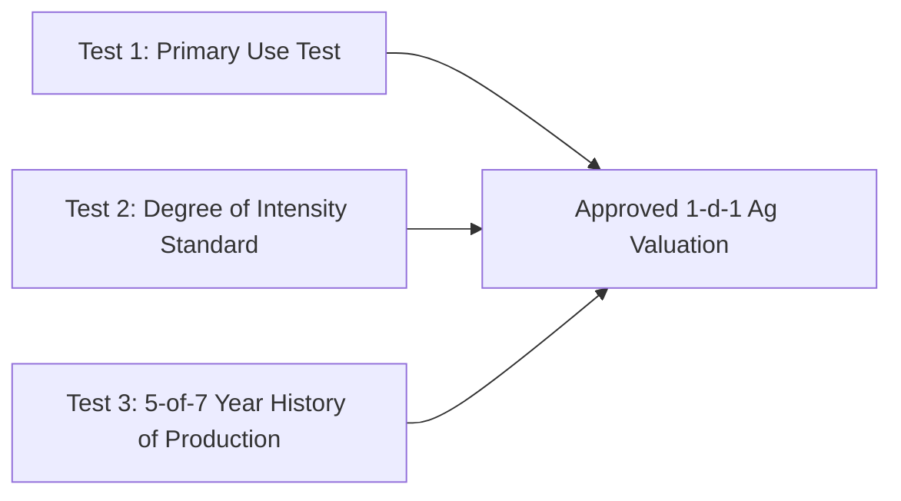

## Understanding Texas 1-d-1 Agricultural Valuation

In Texas, raw acreage and ranch land taxed at full fair market value can create an overwhelming annual property tax burden. Under **Article VIII, Section 1-d-1 of the Texas Constitution** (codified in Texas Tax Code Chapter 23, Subchapter D), land devoted primarily to agricultural production is appraised based on the land's agricultural productive capacity rather than what a developer would pay for it.

For rural landowners across Wise, Parker, Denton, and Montague counties, this difference routinely reduces annual taxes on a 50-acre parcel from $12,000+ per year down to $400–$800 per year.

---

## 3 Core Legal Tests for 1-d-1 Ag Qualification

### 1. The Current Devotion & Primary Use Test
The land must be used *primarily* for agricultural operations, such as raising livestock (cattle, sheep, goats, horses), producing crops (hay, wheat, grain), beekeeping, or timber production. Incidental recreational uses (like hunting or weekend camping) do not disqualify land as long as agriculture remains the primary commercial activity.

### 2. The Degree of Intensity Standard
The property must be farmed or grazed to the *degree of intensity* typical for the region. Each County Appraisal District (CAD) publishes annual agricultural intensity guidelines specifying:
- Minimum Animal Units (AU) per acre (e.g., 1 cow/calf pair per 10–15 acres in Wise County).
- Minimum crop yields or annual hay cuttings (e.g., 1–2 cuttings of improved coastal bermuda hay).
- Minimum beekeeping hives based on acreage size (typically 6 hives on the first 5 acres + 1 hive per additional 2.5 acres).

### 3. The 5-of-7 Year Historical Production Test
The land must have been actively devoted to agriculture for at least **five of the previous seven years** before the year of application.

---

## What Happens When You Purchase Ag-Exempt Acreage?

> [!WARNING]
> **Ag Valuations Do NOT Automatically Transfer to New Owners:**
> When you purchase rural land with an existing 1-d-1 valuation, the exemption is removed upon ownership change. The new buyer **MUST submit a new application (Form 50-129)** to the county appraisal district before **April 30th** of the year following closing. Failing to file will cause the appraisal district to re-tax the property at full market value.

---

## Agricultural Rollback Taxes Explained

If the use of land under 1-d-1 agricultural valuation is changed to a non-agricultural purpose (such as building a commercial subdivision, retail strip, or industrial warehouse), Texas Tax Code §23.55 imposes an **Agricultural Rollback Tax**:
- The county assesses the difference between the taxes paid under ag valuation and the taxes that would have been paid at full market value for each of the **previous 3 years**.
- An annual interest penalty of **5%** is added to each year's difference from the date it would have become delinquent.

In standard Texas real estate contracts (TREC Farm and Ranch Contract Paragraph 10B), contract terms determine whether the buyer or seller is liable for rollback tax assessments.

To review active oil/gas wells, floodplains, and water district boundaries on rural acreage, explore our [North Texas Property Due Diligence GIS Map](/tools/property-due-diligence-map).
