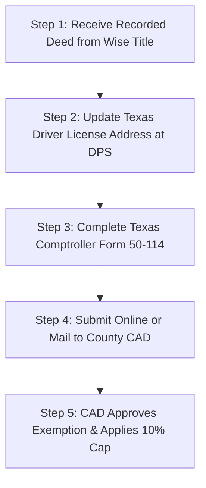

## What is the Texas Homestead Exemption?

A homestead exemption removes a portion of your home's assessed value from property taxation, resulting in substantially lower annual property tax bills.

Under Texas Tax Code Section 11.13, all Texas homeowners who occupy their residence as their primary home are entitled to significant mandatory tax exemptions:

1. **School District Exemption:** A mandatory **$100,000 deduction** from your home's assessed value for Independent School District (ISD) taxes (e.g., Decatur ISD, Bridgeport ISD, Northwest ISD).
2. **County & Special District Exemptions:** Optional county, hospital district, and college deductions (up to 20% of value).
3. **The 10% Homestead Assessment Cap:** Once established, your property's taxable assessed value cannot increase by more than **10% per year**, protecting homeowners from rapid market appreciation shocks.

---

## Exemption Sub-Types & Deductions Breakdown

| Exemption Type | Eligibility Criteria | Statutory Tax Relief |
| :--- | :--- | :--- |
| **General Residence Homestead** | Own and occupy property as primary residence | **$100,000 off ISD value** + 10% annual valuation cap |
| **Age 65 or Older** | Homeowner reaches age 65 during tax year | Additional **$10,000 ISD deduction** + **Permanent School Tax Ceiling** |
| **Disabled Person** | Qualifies for SSDI or federal disability benefits | Additional **$10,000 ISD deduction** + School Tax Ceiling |
| **100% Disabled Veteran** | 100% service-connected disability rating or unemployability | **100% total exemption from ALL property taxes** |
| **Surviving Spouse** | Surviving spouse of qualified 65+ or disabled veteran | Retains deceased spouse's tax ceiling & benefits |

---

## Step-by-Step Guide to Filing Your Texas Homestead Exemption

### Step 1: Update Your Texas Driver's License First
Texas law strictly prohibits appraisal districts from granting a homestead exemption unless the address listed on your Texas Driver's License or Texas State ID card **matches the physical address of the property**.
- Change your address online at the [Texas Department of Public Safety (DPS) Portal](https://www.dps.texas.gov/).
- A temporary change receipt is accepted by most appraisal districts while awaiting your physical plastic card.

### Step 2: Obtain a Copy of Your Recorded Warranty Deed
You will need your recorded Warranty Deed showing your legal ownership. If you closed with Wise County Title Company, your recorded deed with the county clerk's recording stamp is included in your closing packet, or our team can email you a copy.

### Step 3: Complete Texas Comptroller Form 50-114
Use our interactive [Texas Homestead Exemption Assistant](/tools/homestead-exemption-assistant) to pre-fill Form 50-114 and generate county-specific filing instructions.

### Step 4: Submit to Your Local County Appraisal District
Submit the completed form, copy of your Driver's License, and recorded deed to your county CAD:
- **Wise County:** [Wise CAD](https://www.wisecad.org/) | 400 E Business US 380, Decatur, TX 76234 | (940) 627-3081
- **Denton County:** [Denton CAD](https://www.dentoncad.com/) | 3911 Morse St, Denton, TX 76208 | (940) 349-3800
- **Tarrant County:** [TAD](https://www.tad.org/) | 2500 Handley Ederville Rd, Fort Worth, TX 76118 | (817) 284-0024
- **Parker County:** [Parker CAD](https://www.parkercad.org/) | 1108 E Bankhead Dr, Weatherford, TX 76086 | (817) 596-0077
