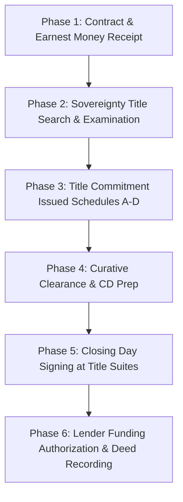

## Overview: The Texas Real Estate Closing Journey

For home buyers and sellers, the period between executing a purchase contract and receiving keys can feel like a black box. Behind the scenes, the title agency acts as an impartial escrow officer, vetting legal ownership chains, gathering tax certifications, clearing debts, and coordinating with mortgage lenders.

At **Wise County Title Company**, continuous operation since 1878 and ownership of the only private sovereignty title plant in Wise County allows us to examine title records rapidly without reliance on third-party backlogs.

---

## The 6 Critical Phases of a Texas Real Estate Closing

### Phase 1: Opening Escrow & Receipting Earnest Money (Days 1–3)
Once buyer and seller execute the TREC One to Four Family Residential Contract, the buyer's agent delivers the contract and earnest money deposit to Wise County Title.

- **Earnest Money Delivery:** Under Paragraph 5 of the standard Texas contract, the buyer must deliver earnest money to the title company within **3 days** of contract execution.
- **Guaranty File (GF) Number:** We issue an official file identifier (e.g., `GF-2026-1234`) and assign a dedicated Escrow Officer.
- **Good Funds Verification:** All earnest money deposits must clear our escrow account in accordance with Texas Insurance Code §2651.202.

### Phase 2: Sovereignty Title Search & Municipal Examination (Days 3–10)
Our title examiners search county property records to construct the complete **Chain of Title** from the original sovereign land patent down to the current owner.

- **Sovereignty Plant Records:** We examine tract books, historical index cards, and computerized deed indexes in our Decatur office.
- **Tax Certificates:** We order official tax certificates from the Wise County Appraisal District (CAD), local Independent School Districts (ISD), and Emergency Services Districts (ESD) to verify that no delinquent property taxes exist.
- **HOA & Municipal Assessments:** We request HOA resale certificates and verify city water/mowing liens.

### Phase 3: Issuing the Texas Title Commitment (Days 10–20)
Within 20 days of receipting the contract, Wise County Title delivers the **Texas Title Commitment** to buyer, seller, real estate agents, and lenders. The commitment is divided into four standard schedules:

| Schedule | Legal Purpose & Contents | Action Required |
| :--- | :--- | :--- |
| **Schedule A** | Names proposed insured, policy amounts, current record owner, and legal description | Verify spelling of names and legal tract |
| **Schedule B** | Standard exceptions, easements, mineral reservations, and rights-of-way | Buyer reviews restrictions & survey exceptions |
| **Schedule C** | Curative requirements (unreleased mortgages, heirship debts, tax liens, judgments) | **Title & Seller must clear before closing** |
| **Schedule D** | Disclosure of title agency officers, underwriters, and premium allocation | Informational disclosure |

### Phase 4: Curative Resolution & Closing Disclosure (CD) Balancing (Days 20–30)
In this phase, our escrow team clears every requirement listed under Schedule C:
- Ordering mortgage payoff statements from seller's existing lenders.
- Obtaining HOA clearance letters and transfer certifications.
- If curative legal drafting is required (e.g., Affidavits of Heirship, correction deeds, or Lady Bird Deed releases), our in-house partnership with **The Berry White Law Firm, PLLC** resolves these issues directly at our Bridgeport and Decatur offices.
- Three business days prior to closing, the lender issues the Closing Disclosure (CD) to the buyer for the mandatory TRID 3-day review window.

### Phase 5: Closing Day & Document Signing
Buyers and sellers arrive at our comfortable closing suites in Decatur (405 Park West Ct) or Bridgeport (1602 Halsell St) to execute all legal closing instruments:
- **For Sellers:** Warranty Deed, T-47 Residential Affidavit, Settlement Statement, and Bill of Sale.
- **For Buyers:** Note, Deed of Trust, Closing Disclosure, Loan Application, and Title Disclosures.
- **Identification Requirement:** All signers must present unexpired, government-issued photo identification (Texas Driver's License, US Passport, or Military ID).

### Phase 6: Funding Authorization & Official County Recording
Signing documents does **not** immediately complete the transaction:
1. **Lender Funding Review:** The escrow officer sends signed loan packages back to the mortgage underwriter for final funding review.
2. **Funding Authorization Code:** Once the lender reviews wet-signed documents and wire funds are received, the lender issues a formal **Funding Authorization Number**.
3. **Disbursement:** The escrow officer disburses sale proceeds to the seller, pays off existing mortgages, and pays real estate commissions.
4. **Key Handover:** Keys, garage openers, and possession are transferred to the buyer.
5. **Electronic Deed Recording (e-Recording):** Wise County Title electronically records the original Warranty Deed and Deed of Trust with the Wise County Clerk, cementing the buyer's public ownership.

---

## Frequently Asked Questions

### Can a buyer get keys right after signing?
No. In Texas, possession cannot be transferred until the transaction has officially funded. Funding occurs only after the lender reviews the signed loan documents and authorizes wire release.

### What should I bring to closing day?
Bring your unexpired government-issued photo ID, any certified funds (or confirmation of wire transfer), and your checkbook for any minor adjustments.
